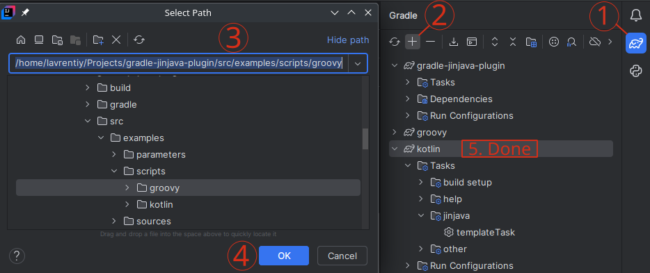

## gradle-jinjava-plugin
This is a gradle plugin for resolving jinja2 template files.

### What is [jinja2](https://jinja.palletsprojects.com/en/stable/api) and why should I use it?
Jinja2 template comes in handy in multiple use-cases. For example if you have few deployments of your application,
and you need to create different (configuration, html) files with the same structure you might want to use some kind of 
templates. Jinja2 is a popular template engine originally developed in python. At some point of time it was 
[implemented in java](https://github.com/HubSpot/jinjava). Personally I find it very comprehensive: it supports `for`
and `if` [statements](https://jinja.palletsprojects.com/en/stable/templates/#list-of-control-structures), 
stream-like [filters](https://jinja.palletsprojects.com/en/stable/templates/#list-of-builtin-filters),
predicate-like [tests](https://jinja.palletsprojects.com/en/stable/templates/#list-of-builtin-tests) and much more.

### Useful info
If you need a simple tool to template 1-2 files, and you don't need to parse parameter files take a look at 
[gradle-jinja2-plugin](https://github.com/shamus13/gradle-jinja2-plugin)<br/>

### Usage examples
<details open>
<summary>Groovy</summary>

```groovy
TaskProvider<JinjavaTask> templateTask = tasks.register("templateTask", JinjavaTask.class) {
    // These are not properties. Use setter methods please
    ignoreMissingExtrasFiles(true)
    // Verbose way to instantiate RegularFileProperty
    final RegularFileProperty paramsFileProperty = objects.fileProperty()
    paramsFileProperty.set(new File("../../parameters/parameters.yaml"))
    addExtraFile(paramsFileProperty)
    // Inline way to obtain RegularFileProperty instance via plugin extension. See JinjavaExtension.createRegularFileProperty
    // Function can consume string, Path, File or a RegularFile. There is a similar function createDirectoryProperty too!
    addExtraFile(jinjava.createRegularFileProperty("/Extras/file/doe/not/exist"))
    mergeStrategy(MergeStrategy.MERGE_MAPS)

    ignoreMissingTemplateFiles(true)
    final RegularFileProperty nonExistentFileProperty = jinjava.createRegularFileProperty(layout.projectDirectory.file("/Template/file/does/not/exist"))
    // Notice .get() for layout.buildDirectory
    addTemplateFile(nonExistentFileProperty, jinjava.createRegularFileProperty(layout.buildDirectory.file("/Destination/directories/wont/be/created").get()))

    addTemplateFile(jinjava.createRegularFileProperty(new File("../../sources/subDir/src.yaml")),
            jinjava.createDirectoryProperty(layout.buildDirectory.dir("templateOutput/subDir").get()))
    addTemplateFile(jinjava.createRegularFileProperty(java.nio.file.Path.of("../../sources/src.html")),
            jinjava.createRegularFileProperty(layout.buildDirectory.file("templateOutput/index.html").get()))
}
```

</details>
<details>
<summary>Kotlin</summary>

```kotlin
val templateTask by tasks.registering(JinjavaTask::class) {
    ignoreMissingExtrasFiles(true)
    // Verbose way to instantiate RegularFileProperty
    val paramsFileProperty: RegularFileProperty = objects.fileProperty()
    paramsFileProperty.set(File("../../parameters/parameters.yaml"))
    addExtraFile(paramsFileProperty)
    // Inline way to obtain RegularFileProperty instance via plugin extension. See JinjavaExtension.createRegularFileProperty
    // Function can consume string, Path, File or a RegularFile. There is a similar function createDirectoryProperty too!
    addExtraFile(jinjava.createRegularFileProperty("/Extras/file/doe/not/exist"))
    mergeStrategy(MergeStrategy.MERGE_MAPS)

    ignoreMissingTemplateFiles(true)
    val nonExistentFileProperty: RegularFileProperty = jinjava.createRegularFileProperty(layout.projectDirectory.file("/Template/file/does/not/exist"))
    // Notice .get() for layout.buildDirectory
    addTemplateFile(nonExistentFileProperty, jinjava.createRegularFileProperty(layout.buildDirectory.file("/Destination/directories/wont/be/created").get()))

    addTemplateFile(jinjava.createRegularFileProperty(File("../../sources/subDir/src.yaml")),
        jinjava.createDirectoryProperty(layout.buildDirectory.dir("templateOutput/subDir").get()))
    addTemplateFile(jinjava.createRegularFileProperty(java.nio.file.Path.of("../../sources/src.html")),
        jinjava.createRegularFileProperty(layout.buildDirectory.file("templateOutput/index.html").get()))
}
```

</details>

<details>
<summary>Tinker with examples</summary>

[Directory with script examples](./src/examples/scripts)

To get autocomplete and other intellij features for scripts in examples directory click gradle -> "+" -> pick 
"gradle-jinjava-plugin/src/examples/scripts/groovy" (or other directory of interest)


</details>

You can look up a lot of information reading javadocs of plugin's methods/classes. Take a look at
[TemplateIOFilesConfigurable](src/main/java/io/goose/rururu387/configs/interfaces/TemplateIOFilesConfigurable.java) and
[ExtrasConfigurable](src/main/java/io/goose/rururu387/configs/interfaces/ExtrasConfigurable.java).

### Q&A
1) What are the RegularFileProperty, DirectoryProperty and FileCollection classes that are passed to multiple functions 
of this plugin?

These classes are used for lazy path evaluation. At 
[configuration phase](https://docs.gradle.org/current/userguide/build_lifecycle.html#sec:build_phases) you might not 
know what are the names and paths of files you want to template. They might be moved by other plugins and their paths 
might be determined later, at execution phase. In these cases you cannot use File objects, but these objects are still
an option.<br/>
If you have good-old File objects then you probably want to convert them to one of those gradle API class instances. You
can instantiate and initialize these classes using ObjectFactory (same syntax for both Groovy and Kotlin DSL):
```declarative
// Create with
RegularFileProperty fileProperty = project.objects.fileProperty()
// Or simply
RegularFileProperty fileProperty = objects.fileProperty()

// And then set value
fileProperty.set(myFileObject)
```
This plugin contains an extension that allows creating FileProperty and DirectoryProperty in one line:
```declarative
// createRegularFileProperty accepts String, File, Path or RegularFile
RegularFileProperty fileProperty = jinjava.createRegularFileProperty("/Extras/file/doe/not/exist")

// createRegularFileProperty accepts String, File, Path or Directory
RegularFileProperty fileProperty = jinjava.createDirectoryProperty("/Extras/file/doe/not/exist")
```
Consider generally using (and probably migrating to?) gradle API classes instead of plain java File and Path classes.

2) Can I use this plugin to enhance my kubernetes/openshift configs?

Please **don't**. Instead try [helm](https://helm.sh/) and [gradle-helm-plugin](https://github.com/Citi/gradle-helm-plugin).
It does better job because it supports config validation. Not only it checks if files are valid yamls but also performs
client-side and server-side validation on demand without actually applying files. It also groups normally decoupled
manifests into helm releases. And you can rollback those releases.  And, on top of that, you can easily enhance your
deployment flow with Kustomize or ArgoCD. Jinja2 isn't supported by Kustomize and hence by ArgoCD.